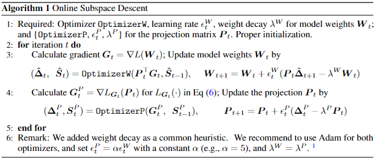
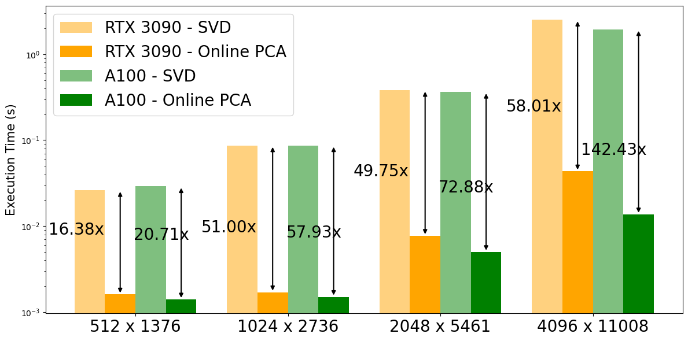
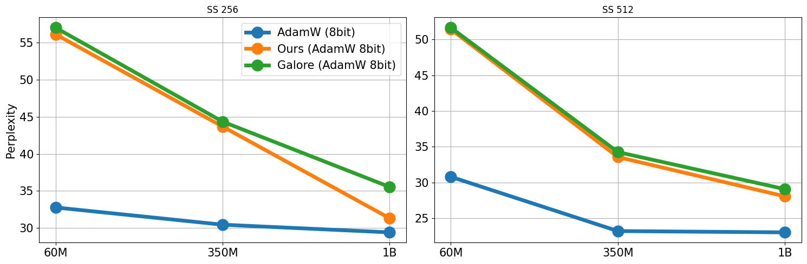

# Online Subspace Descent

This repo contains a pytorch implementation of [Memory-Efficient LLM Training with Online Subspace Descent](https://arxiv.org/abs/2408.12857), a followup on GaLore algorithm, proposed by [GaLore: Memory-Efficient LLM Training by Gradient Low-Rank Projection](https://arxiv.org/abs/2403.03507).

Recently, a wide range of memory-efficient LLM training algorithms have gained substantial popularity. These methods leverage the low-rank structure of gradients to project optimizer states into a subspace using projection matrix found by singular value decomposition (SVD). However, convergence of these algorithms is highly dependent on the update rules of their projection matrix. In this work, we provide the first convergence guarantee for arbitrary update rules of projection matrix. This guarantee is generally applicable to optimizers that can be analyzed with Hamiltonian Descent, including most common ones, such as LION, Adam. Inspired by our theoretical understanding, we propose Online Subspace Descent, a new family of subspace descent optimizer without SVD. Instead of updating projection matrix with eigenvectors, Online Subspace Descent updates projection matrix wtih online PCA. Online Subspace Descent is flexible and introduces only minimum overhead to training. We demonstrate that, for the task of pretraining LLaMA models ranging from 60M to 1B parameters on the C4 dataset, Online Subspace Descent achieves lower perplexity than state-of-the-art low-rank training methods across different settings and narrows the gap with full-rank baselines.

<div align="center">
  
</div>

## Motivation
Online PCA has way lower overhead than computing PCA, especially when model tensor shape gets larger.
<div align="center">
  
</div>


## Installation

### Install experiment dependencies

```bash
pip install -r requirements.txt
```

## Usage and Comparison with GaLore
In comparison with GaLore, 
<div align="center">
  
</div>

Arguments to try out different Optimizers for weight update and projection update
| Weight Optimizer | Arg  |
|------------------|-----------------|
| Adamw      | ```--optimizer galore_adamw```     |
| Adafactor      | ```--optimizer galore_adafactor```     |
| Lion      | ```--optimizer galore_lion```     |
| AdamW8bit | ```--optimizer galore_adamw8bit_per_layer``` |

| Projection Optimizer | Arg  |
|------------------|-----------------|
| adamw      | ```--proj_type continuous```     |
| adam8bit      | ```--proj_type continuous_adam8bit```     |
| LION      | ```--proj_type continuous_lion```     |
| Adafactor      | ```--proj_type continuous_adafactor```     |
| SGD      | ```--proj_type continuous_sgd```     |
| Random   | ```--proj_type random``` |

You can also control the sequence length by adding ```--max_length {sequence_length}``` in your launch command, which is default to 256.

## Benchmark: Pre-Training LLaMA on C4 dataset
`torchrun_main.py` is the main script for training LLaMA models on C4.
For example, to train a 60m model on C4, do the following:

```bash
# LLaMA-60M, Online-Subspace-Descent-Adam, 1 A100, 1 Node
torchrun --standalone --nproc_per_node 1 torchrun_main.py \
    --model_config configs/llama_60m.json \
    --lr 0.01 \
    --galore_scale 0.25 \
    --rank 128 \
    --update_proj_gap 200 \
    --batch_size 256 \
    --total_batch_size 512 \
    --num_training_steps 10000 \
    --warmup_steps 1000 \
    --weight_decay 0 \
    --dtype bfloat16 \
    --eval_every 1000 \
    --optimizer galore_adamw \
    --proj_type continuous
```

### Train 7B model with a single GPU with 24GB memory
To train a 7B model with a single GPU such as NVIDIA RTX 4090, all you need to do is to specify `--optimizer=galore_adamw8bit_per_layer`, which enables `GaLoreAdamW8bit` with per-layer weight updates.
With activation checkpointing, you can maintain a batch size of 16 tested on NVIDIA RTX 4090.

```bash
# Online Subspace Descent
# LLaMA-7B, 8-bit GaLore-Adam, single GPU, activation checkpointing
# bsz=16, 22.8G, 
torchrun --standalone --nproc_per_node 1 torchrun_main.py \
    --model_config configs/llama_7b.json \
    --lr 0.005 \
    --galore_scale 0.25 \
    --rank 1024 \
    --update_proj_gap 500 \
    --batch_size 16 \
    --total_batch_size 512 \
    --activation_checkpointing \
    --num_training_steps 150000 \
    --warmup_steps 15000 \
    --weight_decay 0 \
    --grad_clipping 1.0 \
    --dtype bfloat16 \
    --eval_every 1000 \
    --single_gpu \
    --proj_type continuous_adam8bit \
    --optimizer galore_adamw8bit_per_layer
```

```bash
# GaLore
# LLaMA-7B, 8-bit GaLore-Adam, single GPU, activation checkpointing
# bsz=16, 22.8G, 
torchrun --standalone --nproc_per_node 1 torchrun_main.py \
    --model_config configs/llama_7b.json \
    --lr 0.005 \
    --galore_scale 0.25 \
    --rank 1024 \
    --update_proj_gap 500 \
    --batch_size 16 \
    --total_batch_size 512 \
    --activation_checkpointing \
    --num_training_steps 150000 \
    --warmup_steps 15000 \
    --weight_decay 0 \
    --grad_clipping 1.0 \
    --dtype bfloat16 \
    --eval_every 1000 \
    --single_gpu \
    --optimizer galore_adamw8bit_per_layer
```


## Citation
```bibtex
@misc{liang2024online,
      title={Memory-Efficient LLM Training with Online Subspace Descent}, 
      author={Kaizhao Liang and Bo Liu and Lizhang Chen and Qiang Liu},
      year={2024},
      eprint={https://arxiv.org/abs/2408.12857},
      archivePrefix={arXiv},
      primaryClass={cs.LG}
}
```
